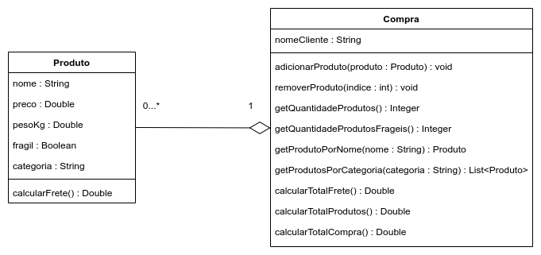

# Avaliação Continuada 01 - Prática 📎

## Orientações Gerais: 🚨
1. Utilize **apenas** tipos **wrapper** para criar atributos e métodos.
2. **Respeite** os nomes de atributos e métodos definidos no exercício.
3. Tome **cuidado** com os **argumentos** especificados no exercício.
   **Não** adicione argumentos não solicitados e mantenha a ordem definida no enunciado.
4. Verifique se **não** há **erros de compilação** no projeto antes de enviar.
5. As classes devem seguir as regras de encapsulamento.
6. Deixe um **construtor vazio** para utilização nos testes unitários.

## Case: Sistema de E-commerce

Olá, caro desenvolvedor(a)! 😃

Estamos desenvolvendo um aplicativo de compras e estamos enfrentando alguns desafios na modelagem e implementação das classes essenciais.

Temos certeza de que você, com sua expertise, pode nos ajudar nessa jornada.

O contexto do aplicativo é simples: queremos gerenciar produtos e suas compras. Por isso, precisamos de duas classes fundamentais: Produto e Compra.

Aqui está a especificação:

**Detalhamento**

- O frete é calculado como 10% do peso do item. Se o item for frágil, o frete será dobrado.
- A classe 'Produto' deve incluir métodos de acesso (getters e setters) e um construtor completo.
- A classe 'Compra' deve ter métodos de acesso (getters e setters) e um construtor que configure os atributos.
- A lista de produtos não deve possuir métodos de acesso (getters e setters).
- O método 'getProdutoPorNome' deve retornar 'null' se o produto não for encontrado.
- O método 'getProdutosPorCategoria' deve devolver uma lista em branco(vazia) se não houver produtos da categoria solicitada.
- Métodos que fornecem valores numéricos nunca devem retornar 'null'.

Esperamos que você possa nos ajudar com esse desafio!

Ao concluir, por favor, compartilhe sua solução para que possamos avaliar.

Muito obrigado e boa sorte! 🍀

**FAQ - Respostas para Dúvidas Frequentes dos Alunos**

1. Posso ajudar um colega?

    a. Não, ajudar um colega caracteriza-se como cola. Se essa situação for confirmada, ambas as partes envolvidas terão suas atividades zeradas e serão encaminhadas ao líder de socioemocional. A atividade é estritamente individual.

2. Quando sai a nota?

    a. A correção não é imediata. A nota será disponibilizada antes da próxima sprint.

    b. Importante destacar que, mesmo se todos os testes forem aprovados, isso não garante uma nota 10 na avaliação prática continuada.

    c. Capricho e organização também serão observados.

3. A prova permite consulta?

    a. Sim, mas a consulta é restrita ao material do aluno, como Moodle e seu próprio código.

4. Posso usar outra IDE?

    a. Não, você deve usar a IDE especificada.

5. Posso adicionar métodos que não estão no enunciado?

    a. Sim, você pode adicionar métodos extras. Entretanto, não remova ou omita nenhum método especificado no enunciado.

6. Posso criar mais atributos que não estão no enunciado?

    a. Sim, você tem essa liberdade. No entanto, saiba que não é obrigatório e os atributos definidos no enunciado devem estar presentes.

7. Posso consultar o GITHUB ou StackOverflow?

    a. Não, como mencionado na resposta do item 3, a consulta é restrita ao material do aluno.

8. Posso utilizar bibliotecas e/ou frameworks externos?

    a. Não. O momento para inovações e uso de ferramentas adicionais será no seu projeto de PI.

9. Devo terminar a prova o mais rápido possível?

    a. Não é uma corrida. Priorize a qualidade e a organização do seu código. Projetos mal organizados ou mal implementados refletirão em sua nota.

10. Tenho uma dúvida sobre o enunciado, o que faço?

    a. Anote sua dúvida e, ao final, comunique ao professor da disciplina.

11. Acredito que o enunciado está com algum erro, o que devo fazer?

    a. Anote o possível erro e comunique ao professor da disciplina ao final da atividade.

12. Posso usar outros softwares para me auxiliar na avaliação?

    a. Você pode utilizar apenas uma calculadora, se sentir necessidade. Nenhum outro software é permitido.

13. Posso usar IA , como ChatGPT, Copilot e derivados?

    a. Não, essas ferramentas, embora úteis, são recomendadas para quem já possui um domínio consolidado do conteúdo. Neste momento, o foco é sua aprendizagem e compreensão individual.

14. Não consegui enviar a atividade dentro do prazo, o que acontece?

    a. Lamentamos, mas se você não enviou no tempo estipulado, sua nota será zero. É crucial estar atento ao tempo.

15. Posso compartilhar meu código da prova no Github ou em outro repositório remoto?

    a. Sim, você pode. No entanto, recomendo que o mantenha em um repositório privado. Se estiver público e alguém copiar seu código, ambos receberão nota zero. Garanta a integridade da sua atividade.
